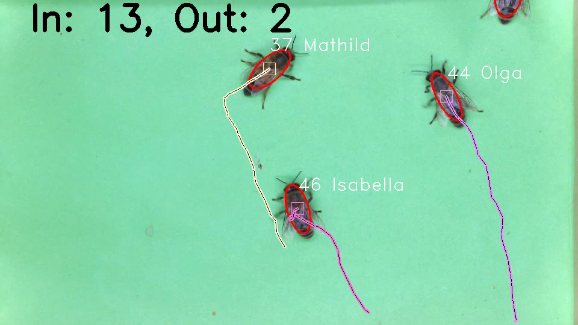
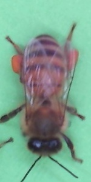
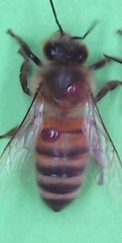
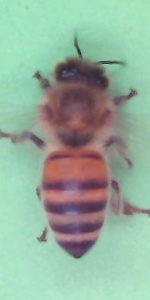
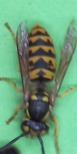
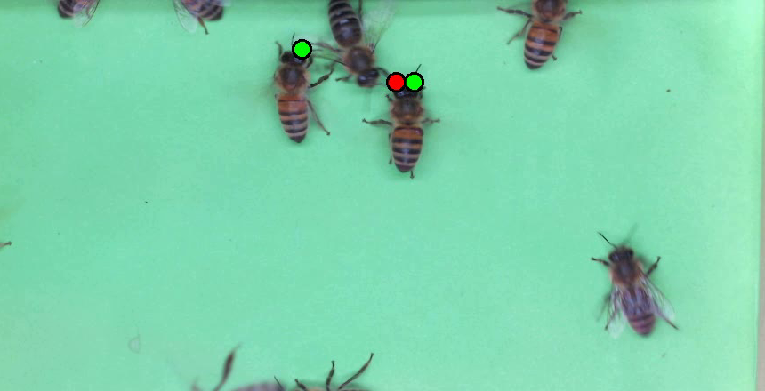
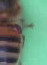
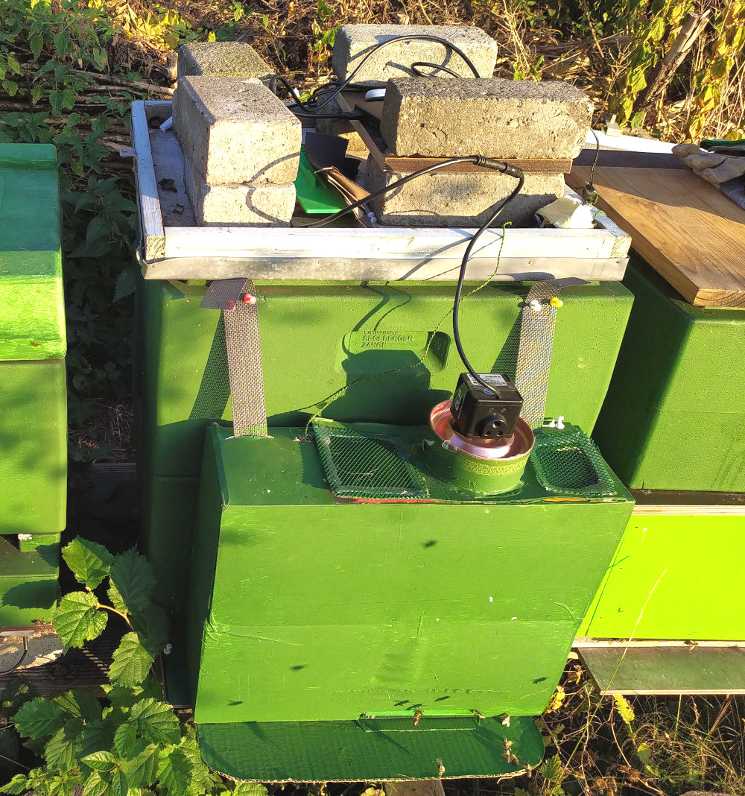
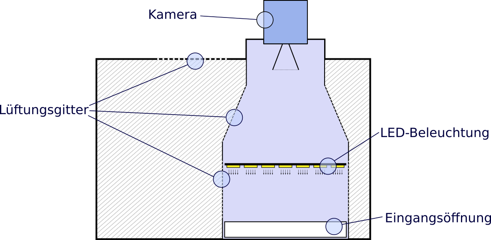
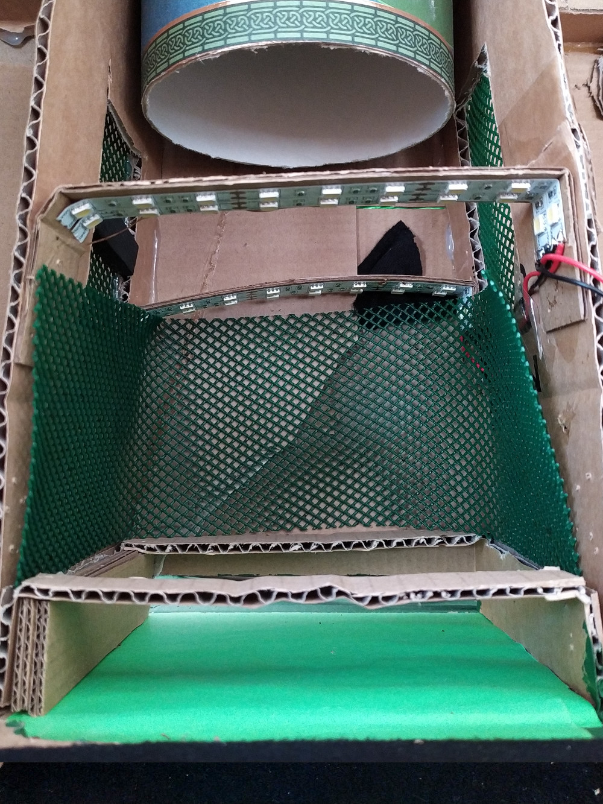

# BeeAlarmed &#128029;&#128029;&#128029;&#127909;

A camera based bee-hive monitoring that identifies and tracks bees. It also identifies bee characteristics with a neural network, such as pollen packages, wasps, varroa mite infestations or bees trying to cool the hive. Therefore, it utilizes tensorflow, opencv, filterpy and others.

This is the result of a private project to develop a camera based bee monitoring system. It was initially made to run on the JetsonNano, but it is not limited to it.

## What it can

It can:
- count bees entering or leaving the hive
- detect and count varroa infected bees
- detect and count bees that are cooling the hive
- detect and count bees with pollen
- find and count wasps

## What it does
It monitors all bees and uses a neural network to detect the above mentioned characteristics, counts all findings and sends them to the ThingsNetwork using LoRaWAN. If you don't like to use LoRaWAN you can change that easily in the code.


## How does it work
Each frame provided by the camera (or video file) will be processed to identify the bees in the image. The found bee positions will then be used to reconstruct the bee movements and paths using kalman filters. The paths are then used to count the bees entering or leaving the hive. Where the hive entry is on the upper part of the filmed pane and the exit is on the bottom.



Each detected bee will then be cut from the image, rotated and forwarded to a neural network for classification.



`A bee carrying a packet of pollen`



`A bee infested by varroa mites.`



`A bee that is coooling the hive. To do so, the bee stays stationary and moves its wings to move fresh air into the hive`



`A typical wasp that can be found stealing honey from the hive`

The neural network performs simple classification tasks to identify bees with pollen, varroa mite infected bees, bees cooling the hive or wasp and counts them. The results can also be visualized. The neural network runs in a separate process and the results may be too late to visualize them, as the bee may have already left the filmed area. But that depends on the performance of the used system. On the JetsonNano, you will probably see that phenomena once in a while.

Below you can see that two bees were detected cooling the hive (green dots), one of them is even infected by varroa (red dot).



Look close, you can see the varroa mite.


## You want to give it a try?

Just check out this repository and install the dependencies:

```
git clone https://github.com/BeeAlarmed/BeeAlarmed.git
cd BeeAlarmed
git submodule init
git submodule update
pip3 install -r requirements.txt
```

Download the pre trained neural network and unzip it to ./SavedModel: <a href="https://raspbee.de/FH/Github/SavedModel_20201121.zip">SavedModel_20201121.zip</a>

```
wget "https://raspbee.de/FH/Github/SavedModel_20201121.zip" -O SavedModel_20201121.zip
unzip SavedModel_20201121.zip -d ./SavedModel
```
Note: _I will publish the dataset and neural network once I finished working on them. The dataset is currently based on manually selected and annotated images (>6000)._

Download the example video file: <a href="https://raspbee.de/FH/Github/cooling_varroa_small.avi">Sample Video</a> (314 MB)

**More videos can be found at YouTube: <a href="https://www.youtube.com/channel/UCpw-FKrTnD0F_UrC_hjI34g/videos">YouTube Channel: Raspbee - Videos</a>**

```
wget "https://raspbee.de/FH/Github/cooling_varroa_small.avi"
```

Now start the monitoring system by calling:

```
python3 main.py --video=./cooling_varroa_small.avi
```

This is what you should get:

<video controls>
  <source src="https://raspbee.de/FH/Github/example_output_small_s.mp4"
  type="video/mp4">
</video>


 - Blue dot: Pollen
 - Red dot: Varroa mite
 - Green dot: Bee is cooling the hive
 - Black dot: Detected a wasp


Please note: _The 'cooling_varroa_small.avi' video file was compressed and thus lost quality compared to the original camera output. The neural network is trained on the original data and may produce false detections with other data. I'll try to link an uncompressed file as well, but it will be large. Detection and tracking of the bees will not be affected by this._

### JetsonNano

On the JetsonNano you have to follow the steps above, but additionally you should install a more lightweight desktop environment. The default one consumes roughly 1.5GB of the available 4GB. I suggest to install the lubuntu-desktop or similar. Here is a guide on how to do it:
https://www.zaferarican.com/post/how-to-save-1gb-memory-on-jetson-nano-by-installing-lubuntu-desktop


## Configuration

You can modify several parameters in the Config.py file.


## You tried & liked it. Now you want to build it yourself?

Below you can find a rough explanation on how to build your own camera system. A more detailed description will follow in the beginning of the next year. I'm currently working on a more robust wooden solution.

### How does camera system looks like?
The below shown camera-system is the first prototype made out of cardboard. But it worked quite well!



The schematic is shown below. The system is simple. A camera films the bees on a pane when they are entering or leving the hive.



The inside looks like this:



As you can see the filmed area is green and illumined by two LED-stripes in the front and back.

## Remarks
- The neural network was trained with data that was collected with the above mentioned camera system. If you build your own system bee monitoring system, you may experience different results due to different camera angles, resolutions, sharpness, background color and so on. In this case you should create your own dataset and train the neural network with it. Once complete, I'll provide my scripts and the dataset that I used to train the network.

## What is still to do?
- Optimize the neural network with live data. Currently everything is based on video material that was captured at the end of the year.
- The neural network is trained on images of the size 75x150 pixels. The results may be better with larger images, but the impact to the performance has to be evaluated.
- Optimize tracking. Some bee tracks are still lost, especially when bees fly around in the camera system.
- Camera input was not yet implemented. Just a minor thing, but I cannot test anything, because the bees are already hibernating.
- Write documentation
